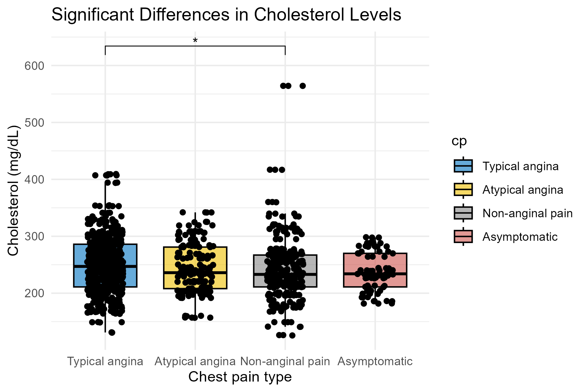

# Project 4 — Group Comparison (Heart Dataset)

## 📌 Project Goal
Examine whether **cholesterol levels** differ across **chest pain types**.

## 📊 Dataset
- Source: UCI / Kaggle Heart Disease dataset  
- Variables:  
  - `chol` (Cholesterol in mg/dL)  
  - `cp` (Chest pain type: Typical angina, Atypical angina, Non-anginal pain, Asymptomatic)

## 🧪 Analysis Overview
- Descriptive statistics (mean, SD, median, IQR) by chest pain type  
- Boxplots to visualize distribution  
- Normality check with QQ plots  
- Homogeneity of variance (Levene’s test)  
- Kruskal–Wallis test (non-parametric, used because normality violated)  
- Post-hoc pairwise comparison using Dunn test with Bonferroni correction  
- Effect size calculation (epsilon squared)

## 📈 Key Findings
- Cholesterol levels differ across chest pain types (**Kruskal–Wallis**: χ² = 8.90, df = 3, p = 0.030)  
- **Post-hoc Dunn test**:  
  - Typical angina vs Non-anginal pain: p.adj = 0.043 (*)  
  - All other pairwise comparisons: not significant  

## 🧠 Effect Size
- Epsilon squared = 0.00578 → small effect

## 🖼️ Visualization
Boxplot with jitter showing cholesterol by chest pain type and significant differences:

## 🧠 Conclusion
Cholesterol levels show **small but statistically significant differences** between some chest pain groups, particularly between Typical angina and Non-anginal pain.  
This analysis illustrates how Kruskal–Wallis and post-hoc tests can be used to compare continuous outcomes across multiple categorical groups in R.

> Note: This project is intended for **learning and methodological practice**, not clinical inference.
